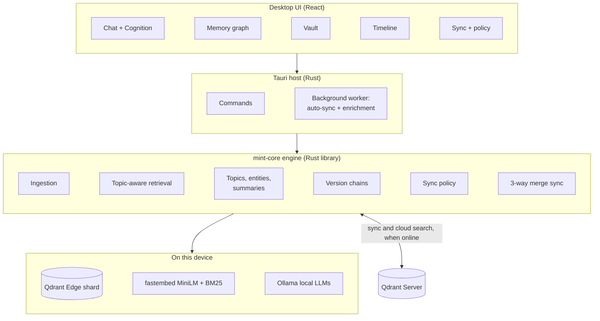
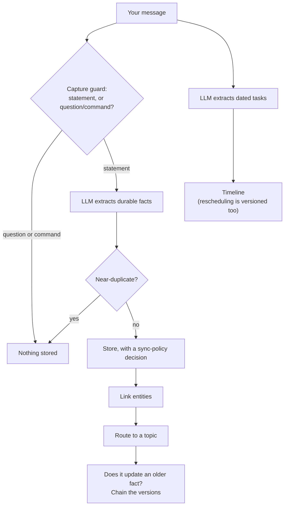
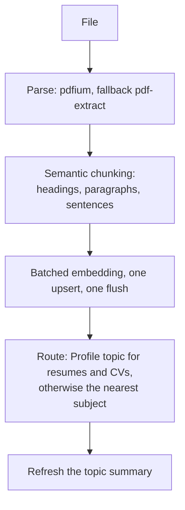
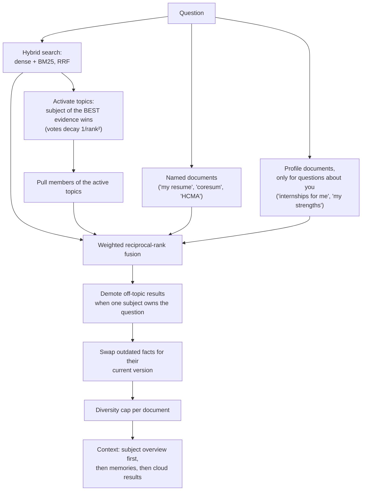
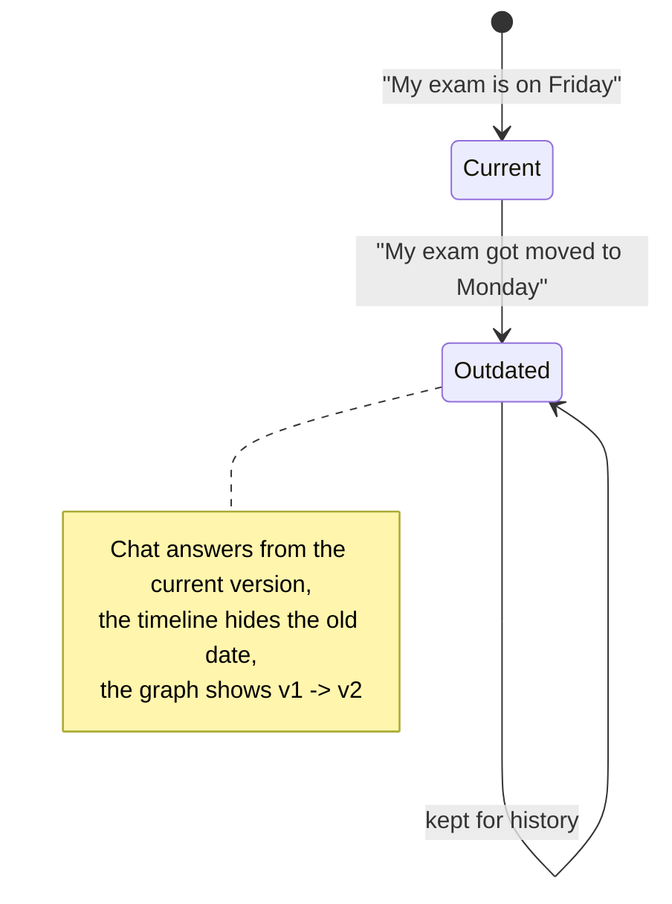
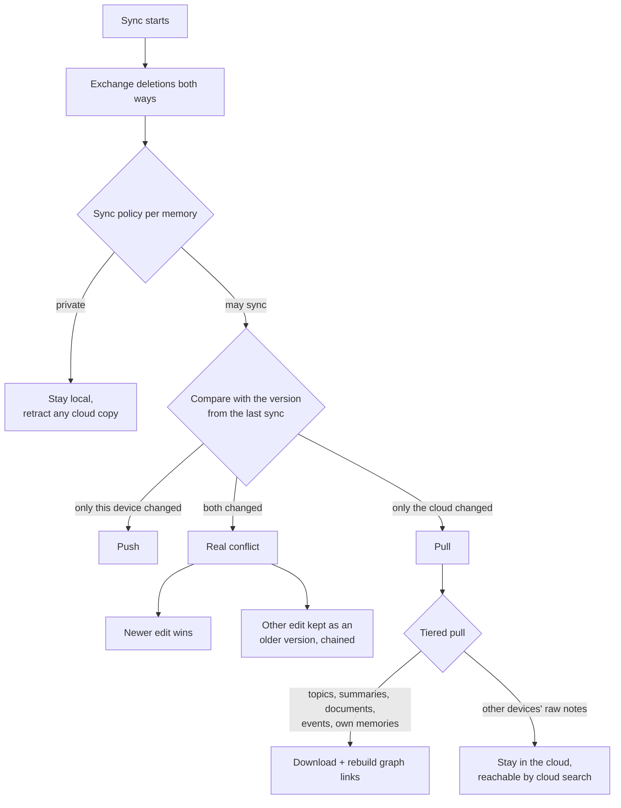
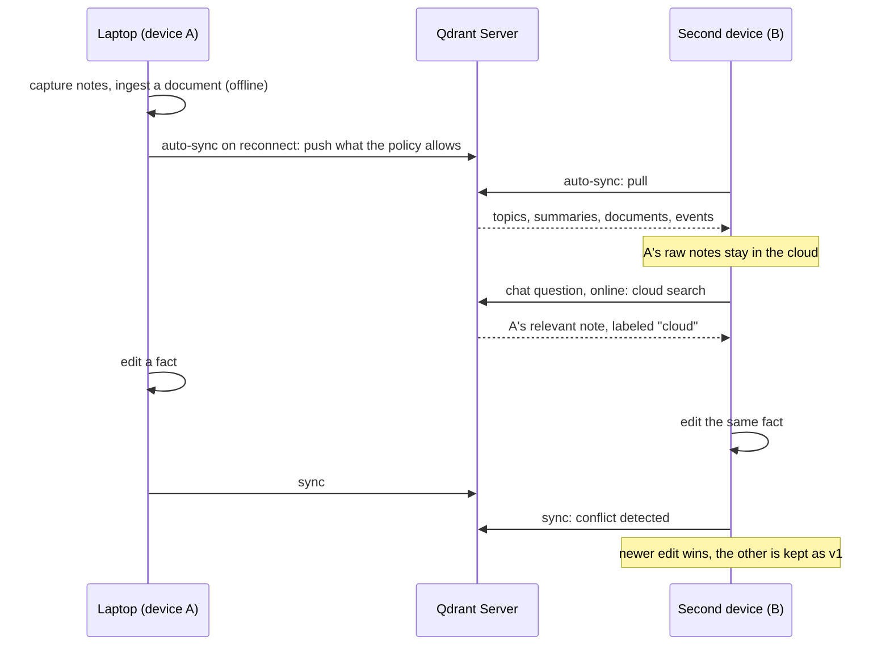
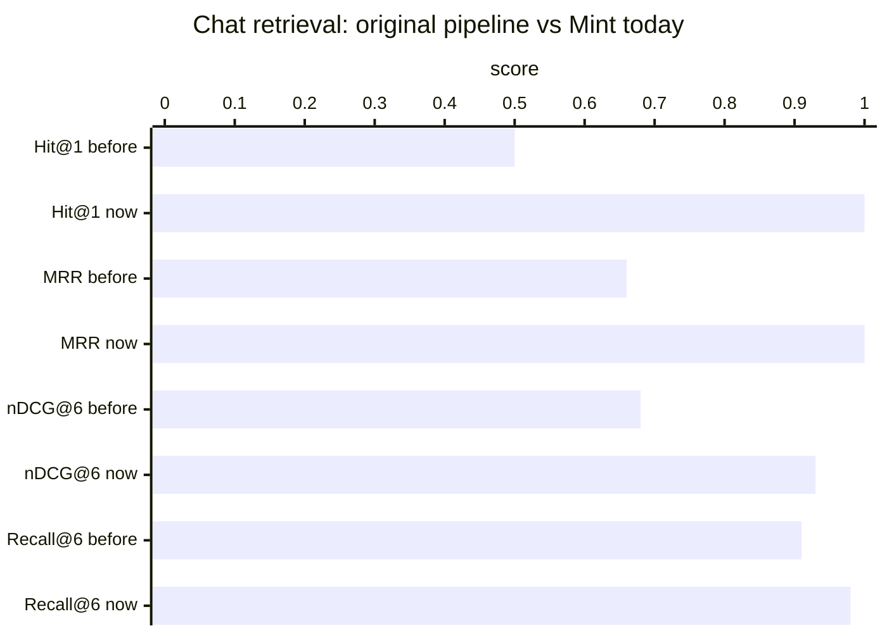
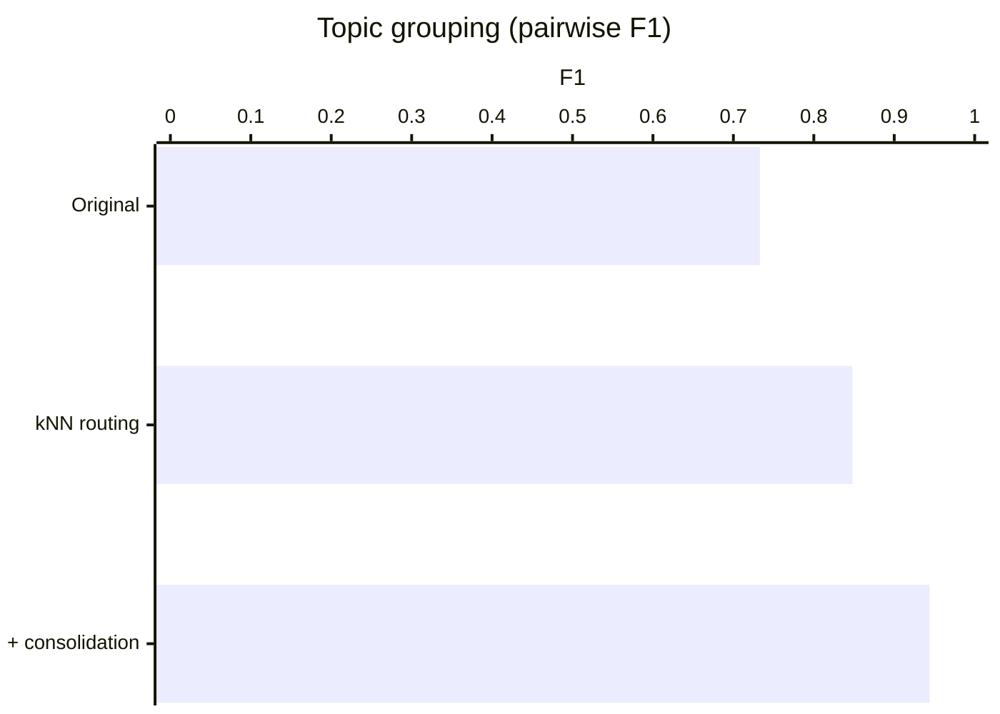

# Mint

**An offline-first AI memory for the edge.** Mint remembers what you tell it and what you
give it, organizes that knowledge into subjects on its own, answers from it in about 5 ms
without a network, and syncs intelligently with a cloud Qdrant Server when one is
reachable. It decides what may leave the device and what never should.

Built on **Qdrant Edge** (embedded vector search), **fastembed** (local embeddings),
and **Ollama** (local language models), in a **Tauri** desktop app with a **Rust** engine.

Licensed under the **GNU AGPL v3.0 or later**. See [License](#15-license).

---

## Contents

1. [The problem](#1-the-problem)
2. [What Mint delivers against the brief](#2-what-mint-delivers-against-the-brief)
3. [Architecture](#3-architecture)
4. [The engines](#4-the-engines)
5. [What makes Mint different](#5-what-makes-mint-different)
6. [Benchmarks and tests](#6-benchmarks-and-tests)
7. [Install](#7-install)
8. [Using Mint](#8-using-mint)
9. [Two devices and the cloud](#9-two-devices-and-the-cloud)
10. [Configuration](#10-configuration)
11. [Privacy and security](#11-privacy-and-security)
12. [Troubleshooting](#12-troubleshooting)
13. [Project layout](#13-project-layout)
14. [Known limitations](#14-known-limitations)
15. [License](#15-license)

---

## 1. The problem

AI applications increasingly run where connectivity is limited, latency is critical,
and sensitive data cannot always leave the device: robots, industrial systems, kiosks,
vehicles, laptops. They need to search and reason over locally generated information
without depending on a cloud service, keep working offline, handle memory that keeps
changing (including contradictory updates), and synchronize the right information with
the cloud when connectivity returns.

The challenge: build an offline-first AI application on **Qdrant Edge** that maintains
local semantic memory, retrieves it with low latency, decides what stays local and what
syncs, synchronizes with **Qdrant Server**, exposes all of it in a UI, and demonstrates a
meaningful edge-to-cloud AI workflow rather than just a local vector database.

## 2. What Mint delivers against the brief

| Goal from the brief | What Mint does | Evidence |
|---|---|---|
| Searchable semantic memory on the device | Qdrant Edge shard embedded in the app, dense + BM25 sparse vectors, payload indexes, on-disk persistence | Survives restarts; all tests run against real shards |
| Low-latency vector and hybrid search, no network | Hybrid dense + sparse search fused with RRF, then topic-aware fusion | ~5 ms median per question; ~8 ms with 150 extra documents |
| Decide dynamically what stays local and what syncs | Per-memory **sync policy** with a stated reason; user overrides; retraction of now-private cloud copies | 44 labeled cases: precision 1.000, recall 1.000 |
| Sync with Qdrant Server when connectivity returns | **Auto-sync** on reconnect, on pending changes, every 2 minutes; manual sync too | 7/7 two-device scenarios against a real server |
| UI to inspect memory, search, sync status, activity | Chat with live reasoning and retrieval panel, memory graph with legend, search/browse, sync screen with policy and activity log | See [Using Mint](#8-using-mint) |
| Keep working offline, intermittent connectivity | Everything is local; an outbox queues changes; all network calls time out fast | Offline test: sync fails fast, retrieval still works |
| Evolving memory, updates, conflicting information | **Version chains** (newer facts supersede older ones), **3-way merge** where real conflicts become versions, never data loss | Versions: precision 1.000; conflict test keeps both edits |
| A meaningful edge-to-cloud AI workflow | **Tiered memory**: devices share consolidated knowledge; raw notes of other devices stay in the cloud and are searched there when online | Cloud search test; chat labels cloud results |

## 3. Architecture



The engine (`crates/mint-core`) is a standalone Rust library: the desktop app is one
host, and the benchmark and tests drive the same library directly.

## 4. The engines

### 4.1 Storage

Each memory is one Qdrant Edge point with a 384-d dense vector (all-MiniLM-L6-v2 via
fastembed) and a BM25 sparse vector, plus a payload (kind, text, topic, provenance,
sync state, version links). Payload indexes on `kind`, `topic_id`, `parent_id` and
others make filtered queries cheap. Documents are stored as a document node plus
chunk nodes, written in one batched embedding call, one upsert, and one flush.

### 4.2 Ingestion

**A chat turn**



**A document (PDF, text, Markdown, code)**



The capture guard stops questions, requests, and commands ("check my resume", "set a
deadline for Friday") from ever becoming memories, which is what keeps the store free
of junk notes.

### 4.3 Retrieval: subject first, then details



Safeguards learned from the benchmark: the top raw hit is never demoted and always
keeps a slot, so many weak matches cannot out-vote one precise match; document names
are matched on whole tokens (so "for" never matches "In**for**med"); compounds and
acronyms are understood ("core-sum" -> "coresum", "HCMA").

### 4.4 Organization: topics, entities, summaries

Every document and note is filed under a **topic**, the schema layer that groups a
research effort, project, or theme.

- **Routing by k-nearest-neighbour vote.** Memories already filed and similar to the
  new content vote for their topic, together with the topic's own rolling summary and
  shared entities. Comparing against what a subject contains, not a three-word name,
  is what keeps grouping accurate.
- **Profile topic.** Resumes, CVs and "about me" documents always go to a dedicated
  topic, so your identity never dissolves into a research subject it mentions.
- **Consolidation.** Online grouping is order-dependent: the first note of a subject
  can arrive before anything similar exists. Maintenance re-homes stragglers once their
  subject is established.
- **Rolling summaries.** The local LLM distills each topic into a short summary and a
  name. The summary is embedded, so both routing and retrieval match what the subject
  is about. Only memories allowed to sync feed a summary.
- **Entities** (people, organizations, concepts) link memories across topics; dates and
  filler never become entities.
- **You stay in control:** rename, merge, move, refresh, organize, all from the graph.

### 4.5 Evolving memory: version chains



A new memory is compared with older memories of the same kind. Deterministic rules
decide first (high similarity plus a revision cue such as "moved to", "switched",
"now", or a changed date or number); only if they say no does the local chat model
judge the closest candidates, which catches changes that need world knowledge ("I live
in Pune" -> "I moved to Bangalore").

### 4.6 Sync policy: what may leave the device

| Stays on the device | Examples |
|---|---|
| Secrets | passwords with values, API keys and tokens, private keys, PINs |
| Financial | Luhn-valid card numbers, bank account and IBAN numbers |
| Government IDs | SSN, Aadhaar, PAN, passport numbers |
| Personal health | first-person health facts ("I'm allergic to peanuts"); a research paper about cancer still syncs |
| Contact details | email addresses, phone numbers, home addresses |
| Derived data | entity hubs (rebuilt on each device) and topics whose members are all private |

Everything else may sync. The decision and its reason are stored on every memory,
re-checked on every write and at every sync, and visible in the UI, where you can
override it. Making something private removes its cloud copy.

### 4.7 Edge <-> cloud sync





A background worker runs every 10 seconds: it syncs when the server becomes reachable,
when changes are pending, and every two minutes; and, while chat is idle, it links
entities for memories that lack them (for example ones pulled from another device),
running the language model outside the engine lock so chat is never blocked.

## 5. What makes Mint different

- **Memory that organizes itself, and can prove it.** Topic routing is measured for
  purity against deliberately similar distractor documents; zero subjects get mixed.
- **Subject-first retrieval.** Evidence activates a subject; the subject brings its
  members; the best evidence can never be out-voted.
- **Private by default where it matters.** A deterministic policy runs on every write,
  with reasons you can read and override, and summaries that cannot leak private
  members.
- **Contradictions become history, not errors.** Updated facts form version chains;
  sync conflicts are preserved as versions instead of being overwritten.
- **Tiered edge-cloud memory.** Devices hold what they need; the cloud holds the long
  tail; chat reaches both when online and works on its own offline.
- **Measured, not claimed.** A labeled benchmark and integration tests against a real
  Qdrant Server ship with the code; every number below can be reproduced.

## 6. Benchmarks and tests

### Methodology

The benchmark (`crates/mint-core/examples/bench`) builds a throwaway engine and ingests
a labeled corpus: research papers, a resume, a study guide, project and personal notes,
and distractors. It asks 20 graded questions designed around real failure modes:
vocabulary mismatch ("which internships suit me" must find the resume), named
documents, topic-scoped questions, exact keywords, and questions whose answer is a
single precise note among many similar ones. An optional scale mode adds 150 distractor
documents, including hard negatives with vocabulary close to the real subjects. It also
scores the capture guard (24 cases), the sync policy (44 cases plus a false-positive
sweep of the corpus), and version chains (14 cases). Deterministic by default; `--llm`
and `--judge` exercise the local language models.

### Retrieval quality (chat pipeline, before and after)



| Metric | Original | Now | Now, +150 distractor docs |
|---|---|---|---|
| Hit@1 (top result correct) | 0.50 | **1.00** | **1.00** |
| MRR | 0.660 | **1.000** | **1.000** |
| nDCG@6 | 0.677 | **0.928** | 0.920 |
| Recall@6 | 0.912 | **0.975** | 0.950 |
| Median latency | 7.8 ms | **5.2 ms** | 8.3 ms |

### Organization quality



The join threshold was chosen by a sweep under 150 distractors: at 0.40 a distractor
topic absorbed a real research paper; at 0.45 every topic stayed pure; above 0.50
related notes split apart.

| Join threshold | Impure topics | Labeled F1 |
|---|---|---|
| 0.40 | 1 (a real paper absorbed) | 0.848 |
| **0.45** | **0** | **0.848** (0.944 with consolidation) |
| 0.50 | 0 | 0.733 |
| 0.55 | 0 | 0.643 |

### Privacy, evolving memory, capture

| Check | Result |
|---|---|
| Sync policy, 44 labeled cases | precision **1.000**, recall **1.000**, category accuracy 1.000 |
| Policy false positives on the research corpus | **0** of 26 items |
| Capture guard, 24 cases | accuracy 0.917 -> **1.000** |
| Version chains, rules only | precision 1.000, recall 0.750 |
| Version chains, rules + llama3.2 judge | precision 1.000, recall 0.750 |
| Version chains, rules + qwen3:8b judge | precision **1.000**, recall **0.875**, current version ranked first 1.000 |

### Performance

| Operation | Result |
|---|---|
| Chunk ingestion, per-chunk path vs batched (same 30-chunk document) | 1504 ms vs 452 ms, **3.3x faster** |
| 150 documents ingested (embedding-bound, no LLM) | ~1.5x faster than the original path |
| Question answering retrieval | ~5 ms median, ~6 ms p95 |

With the language models enabled, ingestion is bound by the models (entity extraction
and summaries run locally); retrieval latency is unaffected.

### Test suite

| Suite | Tests | What it covers |
|---|---|---|
| Unit | 22 | capture guard, policy categories and false positives, entity filtering and aliases, chunking, label cleaning, document references, profile rules, lenient model-output parsing |
| Topic integration | 6 | routing, Profile topic, rename / move / merge / prune, organize, retrieval subjects, entity enrichment |
| Two-device sync (real Qdrant Server) | 7 | private data never leaves, retraction, tiered sharing + cloud search, one-sided edits, concurrent edits kept as versions, deletions, offline |

### Reproduce

```bash
cd crates/mint-core
cargo test --release                                             # all tests
cargo run --release --example bench -- --label mine              # benchmark
cargo run --release --example bench -- --label scale --scale 150 # with distractors
cargo run --release --example bench -- --label llm --llm llama3.2:latest --judge qwen3:8b
```

Results are written to `crates/mint-core/bench-results/`; `--compare <label>` prints the
difference against an earlier run. The sync tests use throwaway collections on the
server at `QDRANT_URL` (default `http://localhost:6333`) and skip if no server is
running; your own collection is never touched.

## 7. Install

These steps are for Windows 10/11, the primary platform. macOS and Linux notes follow.

### 7.1 Prerequisites

| Tool | Version | Why |
|---|---|---|
| Git | any | clone the repository |
| Node.js | 20.19+ (22 LTS recommended) | frontend build (Vite 8) |
| Rust | stable, MSVC toolchain | engine and app |
| Visual Studio Build Tools | 2022, "Desktop development with C++" | Rust on Windows |
| WebView2 | preinstalled on Windows 11 | the app window |
| Ollama | latest | local language models |
| Docker | optional | a local Qdrant Server for sync |

```powershell
rustup default stable-msvc
```

### 7.2 Language models

Install Ollama from https://ollama.com, then pull the two default models (about 7 GB in
total):

```bash
ollama pull qwen3:8b
ollama pull llama3.2
```

`qwen3:8b` answers chat questions and judges version updates; `llama3.2` handles fast
extraction and summaries. Any other pulled models can be used instead (see
[Configuration](#10-configuration)).

### 7.3 Get the code

```bash
git clone <this-repository-url> mint
cd mint
npm install
```

### 7.4 PDF support (recommended)

Mint parses PDFs with Google's pdfium library and falls back to a pure-Rust parser.
The native library is not included in the repository:

1. Download `pdfium-win-x64.tgz` from https://github.com/bblanchon/pdfium-binaries/releases.
2. Extract `bin/pdfium.dll` to `lib/pdfium.dll` inside the project folder.

### 7.5 Optional: a Qdrant Server for sync

```bash
docker run -d --name mint-qdrant -p 6333:6333 -v mint-qdrant:/qdrant/storage qdrant/qdrant
```

Mint works fully without it; the server is only needed for sync and cloud search.

### 7.6 Run

From the project folder, in PowerShell:

```powershell
$env:MINT_DATA_DIR = "$PWD\.mint-data"
$env:MINT_PDFIUM_PATH = "$PWD\lib\pdfium.dll"
npm run tauri dev
```

The first run compiles the engine with optimized dependencies (this can take 10-15
minutes once) and downloads the embedding model (about 90 MB, the only time Mint needs
the internet). After that, startup is quick and everything runs offline.

### 7.7 Build an installer

```bash
npm run tauri build
```

The installer is written to `src-tauri/target/release/bundle/`. Place `pdfium.dll` next
to the installed executable or set `MINT_PDFIUM_PATH`.

### 7.8 macOS and Linux

Install the Tauri system prerequisites for your platform
(https://tauri.app/start/prerequisites/), then follow the same steps. Use
`pdfium-mac-*.tgz` (`libpdfium.dylib`) or `pdfium-linux-x64.tgz` (`libpdfium.so`) and
point `MINT_PDFIUM_PATH` at it, using `export VAR=value` instead of `$env:VAR = "value"`.

## 8. Using Mint

The header shows whether Mint is on-device, which chat model is active, and how many
memories exist.

### Chat

Talk to Mint. The **Cognition** panel streams the model's reasoning; **Retrieved
memory** lists the grounding for each answer (a **cloud** badge marks results from your
other devices); **Captured this turn** shows the facts Mint stored; the pipeline
timeline shows each stage as it happens. Statements such as "I decided to use Rust for
the backend" are remembered; questions and commands are not. Saying something that
changes an earlier fact ("my exam moved to Monday") updates it.

### Memory

- **Graph:** a force-directed map of memories, documents, chunks, entities, and topics.
  Drag to move, scroll to zoom, drag the background to pan, double-click to reset.
  - **Legend:** statistics, topics (click one to focus it), connection types, clusters,
    and memory status (recent, expiring, update chains, outdated, on device only,
    forgotten).
  - **Organize memories:** files every not-yet-organized memory into topics and
    summarizes them. Run it once after upgrading.
  - **Click a topic:** rename, merge into another topic, focus, refresh its summary.
  - **Click a memory:** see why it may sync or stays on the device (and change it), its
    version history, and move it to another topic.
- **List:** search (hybrid, dense, or sparse), capture a memory manually (including
  "local only"), and browse or delete memories.

### Vault

Drop PDFs, text, Markdown, or code files. Each is parsed, chunked, embedded, filed
under a topic, and summarized, all locally.

### Timeline

Tasks and dates extracted from chat. A rescheduled deadline replaces the old date.

### Sync

Connectivity (online / airplane mode), auto-sync, pull mode, server URL and API key,
this device's id, memory state (pending, synced, conflicts, on device only), the sync
policy (what stays local and why, with "Allow sync"), a **Sync now** button, and the
activity log of manual and automatic syncs.

### How it works

An in-app explanation of the pipeline.

## 9. Two devices and the cloud

1. Run a Qdrant Server both devices can reach: a machine on your network (open port
   6333 in its firewall) or Qdrant Cloud.
2. On each device, in **Sync**, set the server URL (and the API key for Qdrant Cloud)
   and turn **Online** on. Settings are saved.
3. Auto-sync does the rest. A new device receives topics, summaries, documents, and
   events; the other device's raw notes stay in the cloud and appear in chat through
   cloud search while online. Turn on **Mirror everything** to copy all shared memories.
4. What never crosses: memories the policy keeps local, chat conversations, and
   per-device statistics. Entity links are rebuilt locally in the background.

## 10. Configuration

| Variable | Default | Purpose |
|---|---|---|
| `MINT_DATA_DIR` | the app data folder (`mint-memory`) | where memories, models, and settings live |
| `MINT_PDFIUM_PATH` | next to the executable, then `./lib/` | path to the pdfium library |
| `MINT_CHAT_MODEL` | `qwen3:8b` (else the first installed model) | chat and version judging |
| `MINT_FAST_MODEL` | `llama3.2:latest` | extraction, entities, summaries |
| `QDRANT_URL` | `http://localhost:6333` | overrides the saved server URL |
| `QDRANT_API_KEY` | none | overrides the saved API key |

Ollama is expected at `http://localhost:11434`.

## 11. Privacy and security

- Everything, including embeddings and language models, runs on your device. The only
  network traffic is the one-time embedding-model download and, if you enable it, sync
  with the Qdrant Server you choose.
- The sync policy keeps secrets, financial and ID numbers, personal health facts, and
  contact details on the device, and removes the cloud copy of anything you make
  private. It is pattern-based: review the Sync screen and use "Keep on device" for
  anything it misses.
- Shared memories are readable by anyone with access to your Qdrant Server. Keep a
  network server behind a firewall, or use Qdrant Cloud with an API key.
- Sync settings, including an API key, are stored locally in `sync.json` in the data
  folder, which is never committed.

## 12. Troubleshooting

| Symptom | Fix |
|---|---|
| Build fails with `os error 4551` (Windows) | Smart App Control blocked a freshly built build script. Build from the project root with `npm run tauri dev` (it uses the trusted `src-tauri/target`), or turn Smart App Control off. |
| "Ollama not running" / no chat model | Start Ollama and pull the models in 7.2. |
| PDFs fail to parse | Check `MINT_PDFIUM_PATH` points to `pdfium.dll`; scanned PDFs without text cannot be parsed. |
| First launch is slow | One-time compilation and embedding-model download; later launches are fast. |
| Sync shows "Server not reachable" | Start the Qdrant container (7.5) or fix the URL in Sync. |
| Port 1420 already in use | Another dev server is running; stop it and retry. |

## 13. Project layout

```
crates/mint-core/        Rust engine library
  src/engine.rs          storage, retrieval, topics, versions, sync, policy decisions
  src/policy.rs          sync policy (what stays on the device)
  src/sync.rs            Qdrant Server client (timeouts, cloud search)
  src/chat.rs            prompts, capture guard, lenient extraction parsing
  src/entities.rs        entity extraction and normalization
  src/documents.rs       PDF/text parsing and semantic chunking
  src/embed.rs           fastembed dense + BM25 sparse embeddings
  src/graph.rs           relationship edges
  src/meta.rs            side metadata (archive, tombstones, sync bases, overrides)
  examples/bench/        labeled benchmark
  tests/                 topic and two-device sync integration tests
src-tauri/               desktop host: commands, background worker
src/                     React UI
```

## 14. Known limitations

- The sync policy is pattern-based, not a language model; unusual secret formats can
  slip through (use "Keep on device").
- Version detection catches 7 of 8 real updates in the benchmark with the qwen3 judge;
  subtle preference changes can be missed.
- Merging topics on one device can leave another device's cloud-only notes pointing at
  the removed topic.
- The benchmark is modest in size (20 questions); a perfect score means it should be
  made harder, not that retrieval is perfect.
- Not yet built: a localhost API and CLI, image understanding, an OS-vault for secrets.


## 15. License

Copyright (C) 2026 Xarch Labs.

Mint is free software: you can redistribute it and/or modify it under the terms of the
**GNU Affero General Public License** as published by the Free Software Foundation,
either version 3 of the License, or (at your option) any later version. It is
distributed in the hope that it will be useful, but WITHOUT ANY WARRANTY; without even
the implied warranty of MERCHANTABILITY or FITNESS FOR A PARTICULAR PURPOSE. See the
[LICENSE](LICENSE) file for the full text.

In short: you may use, study, modify, and share Mint. If you distribute Mint or a
modified version, or let people use a modified version over a network, you must make
the complete corresponding source code available under the same license.

Third-party components keep their own licenses (Qdrant Edge, fastembed, Tauri, and
pdfium are under permissive licenses compatible with the AGPL; language models pulled
through Ollama are under their publishers' licenses).

Contributions are accepted under the same license.

---
Thank You